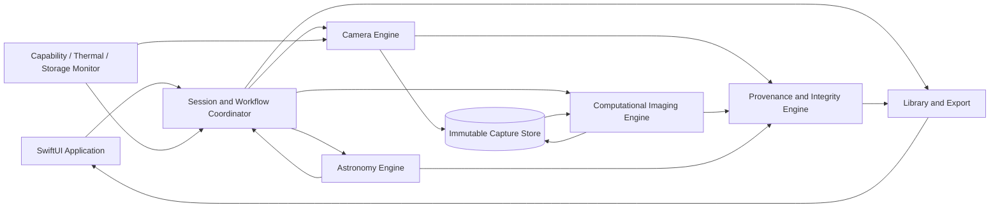
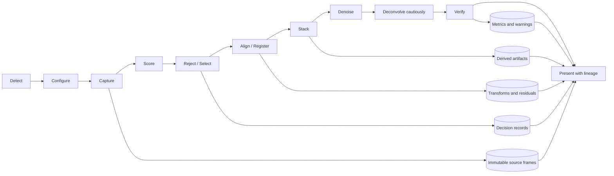

# ASTRA Technical Architecture & MVP Roadmap

**Status:** Architecture proposal for review  
**Scope:** Design only. No iOS application scaffolding or implementation has started.  
**Product target:** Installable native iOS astronomical camera app; iPhone 14 Pro Max is the initial validation device.  
**Decision principle:** Capabilities and image-quality gains are measured at runtime/on device; neither is assumed.

## 1. Executive architecture decisions

1. **Native app first.** Production is a Swift/SwiftUI iOS application. Python/desktop experiments may generate fixtures, analyze sequences and act as reference implementations, but never become runtime dependencies or the product.
2. **Capture and processing are separate.** AVFoundation emits immutable source assets plus metadata. Processing consumes them and creates derived assets without modifying the sources.
3. **Moon-first and intentionally narrow.** The MVP validates one selected camera route, short lunar sequences, frame rejection, registration, robust stacking, restrained denoising, quality checks and before/after review. Planets, deep-sky and generative enhancement are out of MVP.
4. **Capability-driven.** Discover cameras, formats, rates, RAW types, control ranges and dimensions at runtime. A zoom label is not a camera identifier or proof of manual/RAW support.
5. **Preserve evidence.** Keep original frame bytes and acquisition metadata. Store processing operations in an append-only lineage graph. Every result traces back to the source frames.
6. **Deterministic science path.** No generative fill, learned super-resolution or AI-created texture in scientific output. Later learned processing must be separately labeled and non-destructive.
7. **Validate before optimizing.** Burst cadence, RAW resolution, thermal behavior, stabilization, storage and actual lunar improvement require tests on the target phone.

## 2. Product architecture

| Module | Responsibility | Boundary |
|---|---|---|
| **Application/workflow** | Automatic and Scientific modes, Moon workflow, permissions, state, progress, cancellation, library, comparison and export | Orchestrates use cases; no image algorithms or direct device configuration |
| **Camera engine** | Discover physical/virtual cameras and formats; preview; configure supported exposure/ISO/focus/WB; capture stills/frames; collect timestamps/metadata | Emits source assets and capture manifest; does not claim astronomical quality |
| **Astronomy engine** | Lunar disk detection, center/radius/confidence/motion, target lock; later sky-position/object resolution | Observations carry confidence, timestamp and coordinate frame; no implicit object identity |
| **Computational imaging engine** | Decode, score, reject, register, stack, denoise, optional cautious deconvolution, artifact checks and quality metrics | Consumes immutable inputs and versioned recipe; outputs new artifacts and reports |
| **Integrity/provenance** | Source/result lineage, processing classifications, reproducibility and disclosure | Rejects missing lineage, unrecorded operations or mislabeled generated detail |
| **Session/storage** | Durable capture state, asset storage, job queue, interruption recovery and quota handling | Transactional state machine; never edits source frames in place |
| **Library/export** | Browse sessions, compare single frame and stack, show lineage, export image/manifest | Export communicates processed status; app library retains authoritative provenance |
| **Resource monitor** | Memory pressure, thermal state, battery, free storage, supported controls | Pauses/stops/downgrades at explicit stage boundaries; never silently drops evidence |

Suggested logical native boundaries: `AstraApp` (SwiftUI), `AstraWorkflow`, `AstraCapture`, `AstraAstronomy`, `AstraImaging` (data contracts and CPU reference), `AstraImagingMetal` (profiled kernels), `AstraProvenance`, `AstraLibrary`, and `AstraTestsSupport` (fixtures/golden images/device harness). These are boundaries for review, not a request to create targets yet.

## 3. iOS technology architecture

| Technology | ASTRA responsibility | Limits and notes |
|---|---|---|
| **Swift + SwiftUI** | Native experience, accessibility, settings, progress and mode workflows | Keep UI state separate from capture and processing services. |
| **AVFoundation** | `AVCaptureSession`, discovery, preview, still capture, video frame output, device configuration, format/range queries, photo metadata | Clamp each request to active device/format capability. Manual exposure is configured under a device lock; photo quality prioritization affects whether the requested values are honored. [Custom exposure API](https://developer.apple.com/documentation/avfoundation/avcapturedevice/setexposuremodecustom%28duration%3Aiso%3Acompletionhandler%3A) |
| **Core Media + Core Video** | `CMTime`, `CMSampleBuffer`, `CVPixelBuffer`, image planes/orientation | Use device timestamps, not wall-clock time, for frame ordering/alignment. Keep pixel buffers short-lived. |
| **Photo RAW/ProRAW** | Request RAW or processed capture when the active output reports support; preserve the original representation and metadata | Apple documents Bayer RAW and ProRAW paths, with runtime support/format checks. ProRAW includes computational fusion; it is not untouched sensor data. [RAW and ProRAW capture](https://developer.apple.com/documentation/avfoundation/capturing-photos-in-raw-and-apple-proraw-formats) |
| **Core Image (`CIRAWFilter`, `CIContext`)** | RAW/ProRAW decode for preview and supported operations, color conversion and baseline filters | Built-in detail/noise controls are not a validated lunar reconstruction method. Record operations and retain sources. [CIRAWFilter](https://developer.apple.com/documentation/coreimage/cirawfilter) |
| **Vision** | Experiments with generic tracking, optical flow and image registration; possibly a later model | No turnkey Moon detector or ephemeris. ASTRA owns and validates lunar detection. [Vision](https://developer.apple.com/documentation/vision) |
| **Metal** | Profiled GPU kernels: remap, pyramids, correlation, accumulation and masks | Start with a CPU reference and compare GPU output within declared tolerances. [Metal capabilities](https://developer.apple.com/metal/capabilities/) |
| **Core ML** | Optional later small Moon detector or quality suggestion model | Not required for MVP. Learned image-changing operations remain outside science output. Compute placement across CPU/GPU/Neural Engine is configured, not guaranteed by the existence of a Neural Engine. [MLComputeUnits](https://developer.apple.com/documentation/coreml/mlcomputeunits) |
| **Core Motion** | Device attitude/motion for stability guidance and capture context | Not an image correction by itself; record timestamps and accuracy. |
| **Core Location** | Optional observer location for sky coordinate calculations and object ID | Moon Mode can work without it. Request only for a feature that needs it; support manual/omitted coordinates. |
| **PhotoKit** | Optional save-to-Photos and authorization | Keep ASTRA’s working library independent of Photos permission/state. |
| **App-owned files + database** | Source assets, manifests, lineage, job state | Choose SQLite/Core Data/file layout after volume tests. Use atomic writes, checksums, quota and recovery. |
| **OSLog/signposts/MetricKit** | Timing, memory/thermal diagnostics and device instrumentation | Avoid logging image data or precise location. Separate engineering diagnostics from scientific metrics. |

### Camera configuration policy

- Re-enumerate devices, formats, RAW types and controls after session/camera reconfiguration. Persist the capability snapshot with every session.
- Use one selected camera for a sequence initially. Avoid virtual multi-camera switching during a burst unless tests prove geometry/control consistency. Apple documents control limitations for virtual dual-camera devices. [AVCaptureDevice built-in dual camera](https://developer.apple.com/documentation/avfoundation/avcapturedevice/devicetype-swift.struct/builtindualcamera)
- Separate **preview** (low latency/downsampled, may use video frames) from **evidence capture** (still RAW/ProRAW or best validated minimally processed route). Preview is not a substitute for saved science frames.
- Manual exposure, ISO, focus position and white-balance gains are conditional on the selected device and format. Record requested and resolved values; do not imply a setting was applied merely because it appeared in UI.
- Do not promise adjustable aperture: physical phone camera apertures are fixed. Distinguish hardware OIS, video stabilization and post-capture registration; each capture route needs testing.
- Do not promise continuous multi-frame RAW at a particular rate. Compare serial still-photo and video-frame acquisition experimentally; retain format/path labels per frame.

## 4. Computational pipeline

1. **Detect:** Run on downsampled preview. Return lunar candidate center, radius estimate, detector version, confidence and timestamp. Below threshold, show “Moon not locked”; never reuse a stale lock silently.
2. **Configure:** Select a stable camera/format; meter lunar disk and background; choose exposure to avoid clipping and blur; settle controls before capture. Save requested and resolved settings.
3. **Capture:** Assign IDs, timestamps and sequence numbers; persist bytes as they arrive. Cadence/count depend on tested configuration. Mark interruptions/settings changes visibly.
4. **Score:** Compute interpretable components: clipping fraction, disk contrast, edge sharpness/MTF proxy, local motion/registration confidence, noise estimate and exposure consistency. Save all components and version, not only an opaque score.
5. **Reject/select:** Apply frozen versioned thresholds and record each rejection reason. Retain rejected frames unless user deletes them.
6. **Align:** Estimate constrained translation/rotation, refine sub-pixel only when residual and interpolation tests support it. Save transform, reference, method, confidence, overlap mask and residuals.
7. **Stack:** Robust weighted mean/median or sigma-clipped accumulation with explicit clipped pixels and overlap. Exclude failed transforms. Keep best-single and no-denoise stack baselines; record contributing IDs and weights.
8. **Denoise:** Start with conservative deterministic reduction. Protect lunar edges; compare to un-denoised stack and retain parameters.
9. **Deconvolve:** **Off by default in MVP.** Enable only after PSF, regularization, noise model and ringing behavior are characterized; preserve model assumptions and artifact warnings.
10. **Verify:** Check clipping, halos/ringing, seams, invalid pixels, target drift, registration confidence, upscaling and unsupported detail cues. Compare output with best source and matched stack using predeclared metrics.
11. **Present:** Show source/best single, stack and optional processed result with concise lineage. “RAW” identifies source format only; final rendered output is labeled “stacked/processed.”

## 5. Data model and storage

Use immutable source assets, a versioned session manifest and append-only processing records.

| Entity | Core fields |
|---|---|
| **CaptureSession** | `sessionID`, schema/app version, device/OS, start/end UTC, optional consented location/accuracy, mode, target, state, selected camera, capability snapshot, requested plan, asset references |
| **CapabilitySnapshot** | Camera IDs/types; active format/dimensions; supported frame-rate ranges; exposure/ISO bounds; focus/WB support; RAW formats/file types; ProRAW support; photo dimensions; relevant stabilization properties; configuration hash |
| **SourceFrame** | `frameID`, session, asset URI, SHA-256, bytes, encoding/pixel format, dimensions/bit depth if exposed, timestamp/clock domain, sequence, orientation, camera ID, requested/resolved settings, metadata allowlist, detector observation |
| **FrameAssessment** | frame, score version, component metrics, overall score, accepted/rejected/uncertain state, reasons, clipping summary and warnings |
| **AlignmentRecord** | frame/reference IDs, transform and coordinate convention, crop/overlap mask, algorithm/version, confidence, residuals and status |
| **StackRecord** | input IDs, excluded IDs/reasons, algorithm/version, weights, clipping rule, accumulator precision, output dimensions, valid-pixel mask and operation ID |
| **ProcessingOperation** | `operationID`, parent IDs and hashes, operation/class, code/model/kernel version, parameters, timing, compute path, output ID/hash, warnings and status |
| **QualityReport** | source baseline, output, metric definitions/versions/values, clipping, SNR proxy, edge metric, registration residual, artifact flags, comparison method, thresholds and gate decision |
| **ResultArtifact** | `artifactID`, session, URI/hash, dimensions, color space/transfer, encoding, class (source-derived/processed/AI-assisted/synthetic), preview/render relation and export state |
| **LineageEdge** | Parent artifact → operation → child artifact; records all contributing source frames as a directed acyclic graph |

Storage rules:

- Write to app-owned storage first. Temporary file → atomic rename → checksum verification → mark durable.
- Never overwrite source bytes for orientation, decode, registration, denoising or export conversion.
- Previews/thumbnails are regenerable. Keep full source frames until explicit deletion or quota action.
- Estimate session storage from observed rolling bytes/frame plus result/temp reserve. Stop or shorten capture visibly when budget is inadequate.
- Preserve original embedded metadata where possible and also keep a normalized manifest. Redact precise location from exports unless user opts in.
- Version persisted schemas from the first session. Recovery after termination must not label an incomplete session complete.

## 6. Scientific integrity and provenance

| Class | Definition | MVP rule |
|---|---|---|
| **Captured information** | Pixels delivered by the camera capture path with format/settings metadata | Preserve bytes/checksum; identify Bayer RAW, ProRAW, HEIC/JPEG or video frame accurately. ProRAW is not untouched sensor data. |
| **Computationally reconstructed** | Pixels derived from source frames by documented alignment, stacking, denoising, color/tone or deconvolution | Allowed with all inputs/parameters/versions recorded; label as processed. Deconvolution requires PSF/model assumptions. |
| **AI-assisted** | Learned model produces detections, scores, masks or changed pixels | Record model/version/role/input/output. Detector help may be shown separately; model-modified pixels require explicit labeling and opt-in. |
| **Synthetic/generative** | Pixels/features unsupported by captured data, including generative fill/detail | Prohibited in scientific output. Any future creative mode is isolated, explicitly synthetic and cannot replace the science result. |

Required safeguards:

- Every result resolves through a verifiable lineage DAG to source-frame checksums.
- Scientific processing uses a versioned operation allowlist. A new operation requires tests, artifact checks and provenance fields before enablement.
- Detector confidence is not evidence of detail. Moon lock or an AI score cannot prove a feature is real.
- Record source dimensions and all crops/resampling/upscales. Output size must not imply recovered optical resolution.
- Show selected/rejected frames, transform confidence, stack count, operations, comparisons and warnings.
- Keep an original frame and no-deconvolution stack as comparison references. If an export cannot carry lineage, retain the authoritative record in ASTRA and warn about the standalone file.
- Verification is a quality-control gate, not proof of physical truth. Claims must say which metrics improved under which conditions.

## 7. Performance and resource architecture

| Timing / processor | Work |
|---|---|
| **Real time** | Preview, downsampled disk detection, target confidence, motion/stability cue and clipping indicator. Process latest frame and drop stale preview work. |
| **Immediately after capture** | Persist source bytes/metadata, checksum, decode/validity check, thumbnail and cheap blur/clipping pre-score. Must not block next capture beyond measured limits. |
| **Asynchronous after burst** | Full scoring, selection, registration, stacking, denoising, optional deconvolution, artifact checks, quality report and final renders. Jobs cancellable/resumable. |
| **CPU** | Workflow, metadata/checksums, small statistics, reference kernels, file I/O, lineage validation. Correctness fallback/oracle. |
| **GPU (Metal/Core Image)** | Remap/interpolation, pyramids, correlation, accumulation, convolution after profiling. Tile large images; do not duplicate a full burst in memory. |
| **Neural Engine/Core ML** | Optional later compact detector/quality model, only after labeled validation. Never required for capture/stack and never silently changes science pixels. Measure actual runtime/thermal cost. |

Resource controls:

- **Memory:** Initial engineering target: keep processing buffers below 25% of `ProcessInfo.physicalMemory`, subject to device measurement. Decode in bounded batches; tile/spill/recompute rather than retain every full-resolution image. Handle memory warnings by safe cancellation or reduced work.
- **Thermal:** Observe thermal state. Pause/reduce concurrency only at explicit stage boundaries; never silently change capture settings mid-sequence. Record any downgrade.
- **Battery:** Base estimates on measured sessions. Offer low-power mode that reduces frame count or defers processing. Keep captured sources if processing stops.
- **Storage:** Estimate from observed file sizes; reserve room for results, manifests and temporary work. Stop gracefully if reserve runs out.
- **Concurrency:** One capture-session owner, serialized configuration, bounded processing queue and initially one heavy reconstruction job. Keep UI responsive and progress tied to completed work.
- **Capture trade-off:** Video may offer cadence but has its own compression/format/dimension limits; RAW stills have different information and throughput. Device tests choose the MVP evidence route.

## 8. iPhone 14 Pro Max capability assessment

**Verified** means specified by Apple or documented in the API. **Expected** is a design hypothesis requiring runtime confirmation. **Unknown** is not to be promised before device tests.

### VERIFIED capability

- Apple lists a rear Pro camera system with 48 MP Main, 12 MP Ultra Wide and 12 MP 3× Telephoto; it lists Apple ProRAW, main-camera second-generation sensor-shift OIS, and telephoto OIS. [iPhone 14 Pro Max specifications](https://support.apple.com/en-us/111846)
- AVFoundation offers camera discovery/configuration, custom exposure duration and ISO within active-format bounds, focus/WB controls where supported, and runtime format/frame-rate inspection. These do not guarantee every control on every device type/format. [AVCaptureDevice](https://developer.apple.com/documentation/avfoundation/avcapturedevice) · [Formats/rates](https://developer.apple.com/documentation/avfoundation/capture-device-formats)
- AVFoundation documents Bayer RAW/ProRAW and requires querying available RAW types and ProRAW support for the current output/configuration. RAW assets are larger than compressed assets. [RAW/ProRAW capture](https://developer.apple.com/documentation/avfoundation/capturing-photos-in-raw-and-apple-proraw-formats)
- Apple describes ProRAW as combining RAW-workflow benefits with computational multi-image fusion, so the provenance label must not call it a pristine single sensor readout.

### EXPECTED capability

- A still-photo output is expected; RAW/ProRAW is likely on a compatible 14 Pro Max configuration, but the app must query available pixel formats, ProRAW support and dimensions for each selected capture setup.
- Main camera is a strong candidate to investigate due to listed resolution/stabilization; telephoto may frame the Moon more tightly but has lower listed resolution. Which captures more useful lunar information is empirical.
- Manual exposure/focus are likely available on suitable physical camera configurations, but ranges and behavior must be checked for selected camera/format. Requested exposure may be affected by photo-quality prioritization.
- Video may provide higher cadence while still capture may provide larger/minimally processed images. They are distinct operating points, not interchangeable guarantees.

### UNKNOWN / REQUIRES DEVICE TESTING

- AVFoundation device IDs/types and whether each rear module appears discretely or only via a virtual device in the selected session.
- RAW/ProRAW availability, dimensions, bit depth, supported lenses and control behavior for each camera/output/OS combination.
- Real still-photo cadence and stable count of consistently configured RAW/ProRAW frames; no exact fps is promised.
- Video cadence/resolution/format and suitability as linear evidence for lunar stacking.
- Effects of camera switching, OIS, electronic stabilization or system fusion on sequence consistency; whether stabilization can/should be controlled on each route.
- Achievable lunar disk pixel diameter, sharpness, dynamic range, sampling limit and improvement versus matched single frame.
- Sustained processing time, peak memory, energy, throttling, storage/session and acceptable wait time.
- Repeatability of WB/focus locks over longer sequences.

**Device probe report:** Future diagnostic screen/harness should export (without private image contents) device/OS, camera IDs/types, formats/rates, exposure/focus/WB ranges, RAW types, photo dimensions, requested/resolved settings, frame cadence, output dimensions/bytes, thermal state, memory peak and failures. Repeat after OS updates.

## 9. Gated phase roadmap

All values below are **proposed engineering targets**, not existing device guarantees or scientific claims. Phase 0 freezes fixtures and measurement methods. Revise targets only with recorded rationale before gate evaluation. **FAIL** means fix scope/algorithm or explicitly revise a target; do not declare success from subjective appearance.

### Phase 0 — Scientific/Computational Feasibility

- **Objective:** Establish whether controlled lunar-like sequences contain recoverable signal and define reproducible evaluation before iOS work.
- **Scope:** Offline synthetic/controlled sequences; sub-pixel shift, noise, blur, clipping and outlier simulation; CPU registration/stack/metrics; single-frame baselines; artifact checks. Python is a research/test tool only.
- **Dependencies:** Written metrics, labeled synthetic parameters and versioned fixtures. No app code.
- **Outputs:** Feasibility report, golden vectors, candidate methods, resource model, limitations and device experiment plan.
- **Optical information ceiling:** ASTRA must not claim recoverable resolution beyond what is supported by the optical system, sensor sampling, captured spatial-frequency content, registration diversity, and signal-to-noise ratio of the source frames. Upscaling, sharpening, and deconvolution alone do not establish resolution improvement; sub-pixel reconstruction requires known-truth validation.
- **Quantitative gate:** Known-shift registration error ≤0.25 px RMS on ≥90% of non-clipped cases; 16 independent frames yield ≥2.5× median low-gradient SNR-proxy improvement over one frame; edge/MTF50 proxy loss ≤5% versus best source; seeded blur/clipped outlier rejected ≥90%; no output passes integrity checks without source IDs and operation records.
- **PASS/FAIL:** PASS only if criteria run automatically on frozen fixtures and report failure modes. If improvement requires unacceptable artifact/detail loss, pause product claims and redesign hypothesis.

### Phase 1 — Native iOS Capture Foundation

- **Objective:** Establish native camera access and reliable evidence files on target hardware.
- **Scope:** Permissions, session/preview, discovery, capability/settings UI, camera pinning, still/video route experiments, manifest, metadata, app-owned source store. No stack yet.
- **Dependencies:** Phase 0 contracts; macOS/Xcode and physical iPhone 14 Pro Max access.
- **Outputs:** Internal installable build, capability report, sample sequences and storage/recovery notes.
- **Quantitative gate:** Per candidate setup, 100 capture requests yield ≥99 durable outputs; manifest/output counts agree; timestamps strictly ordered; ≥95% requests meet configured exposure/ISO tolerance where route claims manual control; checksum matches for 100% of saved/reloaded assets. Report median/p95 cadence, not an assumed fps.
- **PASS/FAIL:** PASS if at least one stable route is suitable for Moon capture with explicit capability profile; otherwise fix camera selection/control drift or data path.

### Phase 2 — Moon Detection & Assisted Capture

- **Objective:** Detect visible lunar disk, guide exposure/focus and maintain truthful target lock.
- **Scope:** Detector on preview/captured previews; manual tap fallback; confidence, center/radius and lock state; clipping feedback/readiness. Use “Moon candidate” absent validated sky-coordinate identification.
- **Dependencies:** Phase 1, labeled Moon/negative bright-light dataset.
- **Outputs:** Detector/tracker, validation report, confidence and loss/reacquisition UI.
- **Quantitative gate:** Held-out data: recall ≥95%, false-lock ≤1% in defined supported conditions, center error ≤3% disk radius at p95; maintain lock ≥95% over representative 60s preview and declare loss within 1s of disappearance.
- **PASS/FAIL:** PASS after dataset and device preview tests; otherwise provide manual placement as explicit fallback.

### Phase 3 — Multi-frame Quality Selection & Alignment

- **Objective:** Score/reject frames and align accepted lunar frames reproducibly.
- **Scope:** Blur/clipping/noise/contrast components, reason log, lunar ROI, coarse-to-fine translation/rotation, tested sub-pixel refinement and overlap masks.
- **Dependencies:** Phases 0/1; Phase 2 ROI when available.
- **Outputs:** Score/rejection report, transforms/residuals, CPU reference and initial device implementation.
- **Quantitative gate:** Controlled shifted sequences: p95 alignment error ≤0.25 px for high-confidence frames; ≥90% injected poor frames rank below usable; ≤5% false rejection of good frames; failed transforms never stack; every input decision/transform serialized.
- **PASS/FAIL:** PASS if device data also meets targets in ≥20 sessions; otherwise limit capture to validated stability/mount conditions.

### Phase 4 — Lunar Stacking & Reconstruction

- **Objective:** Demonstrate measured improvement on real Moon sequences without unsupported-detail claims.
- **Scope:** Robust registered stack, conservative deterministic denoising, no default deconvolution, source/best-single/stack/processed comparisons.
- **Dependencies:** Phases 0/1/3 and real target-device sequences with metadata/test design.
- **Outputs:** Versioned stack recipe, deterministic outputs, metrics, artifact stress report and performance prototype.
- **Quantitative gate:** Across 30 independent real sequences with ≥16 accepted frames, ≥24/30 show ≥20% improvement in a predeclared low-gradient noise metric versus best single frame; edge/MTF50 proxy loss ≤5%; no new clipping/seam/ringing above thresholds in ≥95%; blind comparison distinguishes lower noise in ≥80% and reports no increased false-detail cues in ≥90%. Report all failures.
- **PASS/FAIL:** PASS permits only measured noise-reduction claims. Any detail-recovery claim requires a separate ground-truth/resolution study.

### Phase 5 — Scientific Verification & Processing Lineage

- **Objective:** Ensure results are traceable, labeled and quality checked.
- **Scope:** Immutable sources/checksums, operation DAG/classes, software/parameter versions, quality reports, rejected-frame review, export manifest and fault injection.
- **Dependencies:** Stable schemas from Phases 1–4.
- **Outputs:** Provenance schema, integrity UI, sidecar/export format and audit report.
- **Quantitative gate:** 100% results resolve to source checksums/operations; every frame has decision or explicit pending/error; injected missing parent, hash mismatch, unlabeled AI and synthetic pixel operation rejected in 100% tests; interrupted write recovers or marks incomplete in 100%; all export labels agree with provenance class.
- **PASS/FAIL:** PASS only with zero silent lineage gaps and required fault classes covered.

### Phase 6 — Integrated ASTRA Moon Mode MVP

- **Objective:** Deliver coherent native capture, processing, verification and review.
- **Scope:** Automatic status/readiness and recommended settings; Advanced/Scientific controls/metrics; Moon Mode, preview/lock, bounded burst, progress/cancel/retry, before/after, library, lineage and export. No planets/deep-sky. Deconvolution disabled unless separately gated.
- **Dependencies:** Phases 1–5 PASS; UX/accessibility review and supported OS matrix.
- **Outputs:** Internal installable release candidate, validated claims/help, test dataset and limitations page.
- **Quantitative gate:** 20 consecutive end-to-end sessions without crash/data loss; p95 camera-ready ≤5s after permission/session warm-up; p95 result ≤120s for validated 32-frame default (revise only from device evidence); 100% correct state transitions; cancel/relaunch preserves sources/lineage in 100% interruption tests; no hidden source replacement/unlabeled processing.
- **PASS/FAIL:** PASS only if measured Phase 4 benefit and Phase 5 integrity remain true in product. Any changed speed target is documented before MVP designation.

### Phase 7 — Real-device validation

- **Objective:** Establish repeatability and operating envelope in realistic use.
- **Scope:** ≥3 physical 14 Pro Max phones, representative iOS versions, storage/temperature states, tripod/handheld, candidate cameras, Moon phases/elevations, sky brightness, interruptions and exports. Collect anonymized metrics with consent.
- **Dependencies:** Integrated candidate, protocol, privacy/consent plan and device access.
- **Outputs:** Validation report, supported configuration matrix, release recommendation and revised defaults/guardrails.
- **Quantitative gate:** ≥50 field sessions across ≥3 phones; ≥90% complete without crash/data loss; storage/checksum/lineage integrity 100%; documented stack improvement in ≥70% eligible sessions with every failure reported; no thermal/memory event silently changes settings or loses sources; claims match evidence.
- **PASS/FAIL:** PASS supports limited claims for the validated envelope only; otherwise narrow support or improve before external release.

### Later expansion phases

| Mode | Scope | Gate before release |
|---|---|---|
| **Planets** | Jupiter, Saturn, Mars, Venus; per-target exposure, ROI, tracking and short-frame stack | Separate target datasets; ≥90% detection in defined conditions; p95 registration ≤0.25 px; target-specific improvement/artifact thresholds; no Moon claim reused. |
| **Stars/star fields** | Point-source detection, star registration, short exposures, sky rotation and fixed-camera motion | Measured SNR/limiting-magnitude gain, star-shape/trail bounds, timestamp/location metadata and distinct tripod/tracking claims. |
| **Milky Way** | Wide-field low-light sequences, calibration frames feasibility and sky/foreground handling | Sensor-noise/calibration study; no sky replacement; quantified SNR and resource gates. |
| **Meteors** | High-cadence event capture and candidate transient detection | Validated cadence/recall/false-positive tests; rolling-buffer policy; disclose gaps. |
| **Satellites** | Moving object detection/tracking and trajectory annotation | Timestamp uncertainty and orbit match validated; unidentified streaks remain candidates; preserve sequence. |
| **Telescope-assisted** | Adapters, changed PSF/focal length/vignetting, manual focus, mount/tracking | Calibration per supported optics; vignetting/field curvature tests; updated exposure/registration and explicit accessory matrix. |

## 10. Precise Moon Mode MVP definition

ASTRA may be called **Moon Mode MVP** only when an installable native iOS app passes these conditions:

1. **Native capture:** Live preview and evidence route on declared supported iPhone setup, runtime capability disclosure, persisted actual frame metadata/settings.
2. **Honest target handling:** Moon candidate detector or manual placement; lock confidence and loss state; no stale false lock.
3. **Controlled burst:** Bounded lunar sequence with progress/cancel/recovery. Every frame is durable or explicitly failed and source bytes are checksummed.
4. **Selection/alignment:** Every frame has a score and accepted/rejected/uncertain reason. Accepted frames have persisted transforms/confidence; failed transforms are excluded.
5. **Measured benefit:** Multi-frame stack repeatably improves predeclared metrics over the best single source on real device data. Claims stay within tested metrics/conditions.
6. **Conservative rendering:** Deterministic operations only; no generative fill, synthetic texture, hidden super-resolution or unverified deconvolution. Learned image changes remain outside the science path absent separately approved validation/labeling.
7. **Verification/provenance:** Result links to inputs, decisions, parameters, versions, metrics, warnings and hashes. UI distinguishes source, stack and processed result; export carries sidecar or limitation notice.
8. **Usable workflow:** Automatic and Advanced/Scientific paths, processing progress, comparison, local library, export, interruption recovery and clear storage/thermal errors.
9. **Validated claims:** Real-device tests establish repeatability/resources; user-facing claims say what was measured and avoid implying a telescope or unsupported detail.

If measured benefit, source integrity or provenance fails, ASTRA may remain an experimental camera prototype but must not be called the Moon Mode MVP.

## 11. Decisions for architecture review

- Compare still RAW, ProRAW and video frames per camera; select one validated primary evidence path for MVP.
- Empirically compare main-camera resolution with telephoto image scale; do not hard-code a winner.
- Freeze improvement metrics and independent evaluation in Phase 0 to prevent post-hoc metric selection.
- Start registration with constrained translation/rotation; add complex warps only with a physical rationale and ground-truth validation.
- Keep deconvolution disabled in initial MVP until PSF/noise assumptions and artifact bounds are established.
- Set default frame count only after capture cadence, actual bytes/frame and processing memory are measured.
- Moon Mode need not require location; future object identification may require time/location or manual input.
- Set minimum supported iOS after checking current toolchain and API availability; this proposal does not assume one.

## 12. Apple references

- [iPhone 14 Pro Max technical specifications](https://support.apple.com/en-us/111846)
- [AVCaptureDevice](https://developer.apple.com/documentation/avfoundation/avcapturedevice)
- [Custom exposure duration and ISO](https://developer.apple.com/documentation/avfoundation/avcapturedevice/setexposuremodecustom%28duration%3Aiso%3Acompletionhandler%3A)
- [AVCaptureDevice formats and frame-rate ranges](https://developer.apple.com/documentation/avfoundation/capture-device-formats)
- [RAW and Apple ProRAW capture](https://developer.apple.com/documentation/avfoundation/capturing-photos-in-raw-and-apple-proraw-formats)
- [AVCapturePhotoOutput](https://developer.apple.com/documentation/avfoundation/avcapturephotooutput)
- [CIRAWFilter](https://developer.apple.com/documentation/coreimage/cirawfilter)
- [Vision](https://developer.apple.com/documentation/vision)
- [Metal capabilities](https://developer.apple.com/metal/capabilities/)
- [Core ML compute units](https://developer.apple.com/documentation/coreml/mlcomputeunits)
